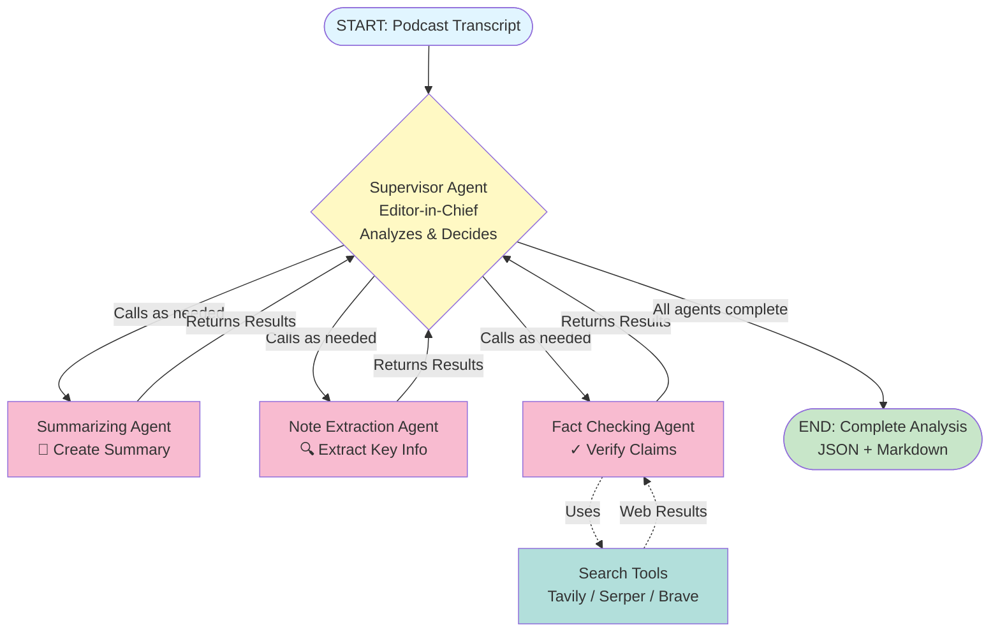

# Podcast Agent - AI-Powered Podcast Analysis

A sophisticated multi-agent system built with LangGraph that analyzes podcast transcripts using a supervisor-coordinated workflow with intelligent specialist agents, deep fact-checking, and comprehensive CloudWatch-compatible logging.

## Features

- **Supervisor-Coordinated Workflow**: Editor-in-Chief agent orchestrates specialist agents as tools
- **Intelligent Failover**: Llama Maverick primary models with automatic failover to Claude Haiku
- **Real-Time Specialist Agents**:
  - Summarizing Agent: Extracts core themes and comprehensive summaries
  - Note Extraction Agent: Pulls out takeaways, quotes, topics, and factual statements
  - Fact Checking Agent: Verifies claims using multiple search tools
- **Real-Time Progress**: Server-Sent Events (SSE) for live updates with detailed agent reasoning
- **CloudWatch-Ready Logging**: Structured JSON logs with session tracking for AWS CloudWatch
- **Auto-Validation Retry**: LLM self-correction mechanism for Pydantic validation failures
- **Output Files**: Automatically generates JSON and Markdown reports with fact-check tables
- **Single Container Deployment**: Easy Docker deployment to Render.com or any Docker platform
- **Professional UI**: Clean, responsive interface with real-time thought process visualization
- **Session Tracking**: Unique session IDs for each analysis with full traceability

## Architecture

### Agent Workflow



### How It Works

1. **User Input**: Podcast transcript is submitted via web UI or API
2. **Supervisor Agent** (Editor-in-Chief):
   - Analyzes the transcript
   - Orchestrates specialist agents as **tool calls**
   - Manages data flow between agents
   - Consolidates all results into final output

3. **Specialist Agents** (Called as Tools):
   - **Summarizing Agent**: Creates 200-300 word summary with core theme
   - **Note Extraction Agent**: Extracts takeaways, quotes, topics, and factual statements
   - **Fact Checking Agent**: Verifies claims using web search tools

4. **Search Integration**: Fact Checking Agent uses Tavily/Serper/Brave for verification

5. **Output**: Comprehensive JSON and Markdown reports with verified information

### Models Used (with Failover)

All agents use **Llama Maverick** as primary with automatic failover to **Claude Haiku 4.5**:

- **Supervisor Agent**: Llama-4-Maverick-17B → Claude Haiku 4.5 (fallback)
- **Summarizing Agent**: Llama-4-Maverick-17B → Claude Haiku 4.5 (fallback)
- **Note Extraction Agent**: Llama-4-Maverick-17B → Claude Haiku 4.5 (fallback)
- **Fact Checking Agent**: Llama-4-Maverick-17B → Claude Haiku 4.5 (fallback)

**Failover Triggers**: API errors, rate limits, network errors, or any model failure automatically triggers fallback to Claude Haiku with full CloudWatch logging.

### Search Tools

- **Tavily**: Advanced search with comprehensive filtering
- **Google Serper**: Current web search results
- **Brave Search**: Privacy-focused search engine

*(At least one search tool API key required)*

## Quick Start (macOS)

### Prerequisites

1. **Homebrew** (if not installed):
   ```bash
   /bin/bash -c "$(curl -fsSL https://raw.githubusercontent.com/Homebrew/install/HEAD/install.sh)"
   ```

2. **Docker Desktop for Mac**:
   ```bash
   brew install --cask docker
   # Open Docker Desktop from Applications to complete setup
   ```

3. **Git** (usually pre-installed):
   ```bash
   brew install git  # If needed
   ```

### 5-Minute Setup

1. **Clone the repository**
   ```bash
   git clone <repository-url>
   cd assignment
   ```

2. **Configure API keys**
   ```bash
   cp .env.example .env
   # Edit .env with your actual API keys (see API Keys section below)
   nano .env  # or use your preferred editor
   ```

3. **Start with Docker**
   ```bash
   docker-compose up --build
   ```

4. **Access the application**
   ```
   http://localhost:8000
   ```

5. **Verify it's working**
   ```bash
   curl http://localhost:8000/api/health
   ```

## API Keys Setup

### Required API Keys

#### 1. Anthropic API Key
**Used for**: Claude Haiku 4.5 (failover model for all agents)

**Get your key**:
1. Visit https://console.anthropic.com/
2. Sign up or log in
3. Go to "API Keys" section
4. Create a new key
5. Copy the key (starts with `sk-ant-`)

```bash
ANTHROPIC_API_KEY=sk-ant-api03-...
```

#### 2. Llama API Key
**Used for**: Llama-4-Maverick-17B (primary model for all agents)

**Get your key**:
1. Visit https://www.llama-api.com/ or your Llama API provider
2. Sign up for an account
3. Generate an API key
4. Copy the key

```bash
LLAMA_API_KEY=LL-...
```

#### 3. Search Tool API Key (Choose at least ONE)

**Option A: Tavily (Recommended)**
- Visit https://tavily.com/
- Sign up and get your API key
- Free tier: 1,000 requests/month

```bash
TAVILY_API_KEY=tvly-...
```

**Option B: Serper**
- Visit https://serper.dev/
- Sign up and get your API key
- Free tier: 2,500 requests/month

```bash
SERPER_API_KEY=...
```

**Option C: Brave Search**
- Visit https://brave.com/search/api/
- Request API access
- Get your API key

```bash
BRAVE_API_KEY=...
```

### Optional API Keys

#### LangSmith (for Observability & Debugging)

**Get your key**:
1. Visit https://smith.langchain.com/
2. Sign up or log in
3. Go to Settings → API Keys
4. Create a new key

```bash
LANGSMITH_TRACING=true
LANGSMITH_ENDPOINT=https://api.smith.langchain.com
LANGSMITH_API_KEY=lsv2_pt_...
LANGSMITH_PROJECT=your-project-name
```

### Complete .env File Example

```bash
# LLM API Keys (Required)
ANTHROPIC_API_KEY=sk-ant-api03-your-key-here
LLAMA_API_KEY=LL-your-key-here

# Search Tool API Keys (At least one required)
TAVILY_API_KEY=tvly-your-key-here
SERPER_API_KEY=your-serper-key-here  # Optional
BRAVE_API_KEY=your-brave-key-here    # Optional

# LangSmith Tracing (Optional - for observability)
LANGSMITH_TRACING=true
LANGSMITH_ENDPOINT=https://api.smith.langchain.com
LANGSMITH_API_KEY=lsv2_pt_your-key-here
LANGSMITH_PROJECT=podcast-analysis
```

## Installation

### Option A: Docker (Recommended)

#### Install Docker Desktop (if not already installed)
```bash
brew install --cask docker
```

Open Docker Desktop from Applications and wait for it to start (Docker icon appears in menu bar).

#### Build and Run
```bash
# Clone repository
git clone <repository-url>
cd assignment

# Configure environment variables
cp .env.example .env
nano .env  # Add your API keys

# Build and start the application
docker-compose up --build

# The application will be available at http://localhost:8000
```

#### Docker Commands

```bash
# Start in detached mode (background)
docker-compose up -d

# View logs
docker-compose logs -f

# Stop the application
docker-compose down

# Rebuild after code changes
docker-compose up --build

# Clean rebuild (clears cache)
docker-compose build --no-cache
docker-compose up
```

### Option B: Local Development

#### Install Python 3.12+
```bash
brew install python@3.12
```

#### Install uv (Fast Python Package Manager)
```bash
curl -LsSf https://astral.sh/uv/install.sh | sh
# Restart your terminal or run:
source $HOME/.cargo/env
```

#### Install Dependencies and Run
```bash
# Clone repository
git clone <repository-url>
cd assignment

# Configure environment variables
cp .env.example .env
nano .env  # Add your API keys

# Install dependencies
uv pip install -e .

# Run the application
uvicorn app.main:app --host 0.0.0.0 --port 8000
```

## Usage

### Web Interface

1. Navigate to `http://localhost:8000`
2. Choose input method:
   - **Sample Transcripts**: Select from pre-loaded examples
   - **Upload File**: Upload .txt or .json file (minimum 100 characters)
   - **Paste Text**: Directly paste transcript text
3. Click "Analyze" and watch real-time progress with:
   - Supervisor decisions and agent coordination
   - Agent-by-agent progress (Summarizing → Note Extraction → Fact Checking)
   - Thought process visualization
   - Quality metrics dashboard
4. Review comprehensive results:
   - Summary with core themes and key discussions
   - Top 5 takeaways
   - Notable quotes with timestamps
   - Topics for tagging
   - Fact-checked claims with verification status
   - Quality metrics (overall reliability, research quality)
5. Download results as JSON or Markdown

### API Endpoints

#### Analyze Transcript (with SSE streaming)

```bash
curl -X POST http://localhost:8000/api/analyze \
  -H "Content-Type: application/json" \
  -d '{
    "transcript": "Your podcast transcript here...",
    "metadata": {
      "title": "Episode Title",
      "date": "2024-01-15"
    }
  }'
```

#### Upload File

```bash
curl -X POST http://localhost:8000/api/analyze/file \
  -F "file=@transcript.txt"
```

#### Health Check

```bash
curl http://localhost:8000/api/health

# Response:
# {
#   "status": "healthy",
#   "models_configured": 4,
#   "search_tools_available": 1
# }
```

#### List Sample Transcripts

```bash
curl http://localhost:8000/api/samples
```

#### Get Specific Sample

```bash
curl http://localhost:8000/api/samples/{sample_id}
```

## Configuration

### Application Settings (config.yaml)

```yaml
models:
  # Supervisor model - Primary: Llama Maverick, Fallback: Claude Haiku
  model_c:
    provider: "llama"
    name: "Llama-4-Maverick-17B-128E-Instruct-FP8"
    temperature: 0.2
    max_tokens: 4000
    fallback:
      provider: "anthropic"
      name: "claude-haiku-4-5"
      temperature: 0.2
      max_tokens: 4000

  # Fact-checking model - Primary: Llama Maverick, Fallback: Claude Haiku
  model_d:
    provider: "llama"
    name: "Llama-4-Maverick-17B-128E-Instruct-FP8"
    temperature: 0.1
    max_tokens: 8000
    fallback:
      provider: "anthropic"
      name: "claude-haiku-4-5"
      temperature: 0.1
      max_tokens: 8000

search_tools:
  tavily:
    search_depth: "advanced"
    max_results: 10
  serper:
    num_results: 10
  brave:
    count: 10

app:
  debug: false
  max_retries: 3           # LLM validation retry attempts
  stream_delay_ms: 100     # SSE event delay
```

### Customizing Models

You can adjust model parameters in `config.yaml`:

- **temperature**: Lower (0.1-0.3) for more focused outputs, higher (0.7-1.0) for more creative
- **max_tokens**: Increase for longer outputs (affects cost)
- **fallback**: Configure different fallback models or disable by removing fallback section

## CloudWatch Logging

All logs are output in JSON format, ready for AWS CloudWatch ingestion:

```json
{
  "timestamp": "2025-11-06T10:30:45.123456Z",
  "level": "INFO",
  "logger": "app.agents.supervisor",
  "message": "Tool execution completed successfully",
  "session_id": "a1b2c3d4-e5f6-7890-abcd-ef1234567890",
  "agent": "Summarizing Agent",
  "tool": "summarize_podcast_tool",
  "stage": "tool_execution_complete",
  "duration_ms": 2345,
  "environment": "production"
}
```

### CloudWatch Query Examples

```sql
# Find all sessions that triggered failover
fields @timestamp, session_id, agent, failover_triggered, failover_reason
| filter failover_triggered = true
| sort @timestamp desc

# Track a specific session
fields @timestamp, stage, agent, message
| filter session_id = "your-session-id"
| sort @timestamp asc

# Monitor performance
fields @timestamp, agent, duration_ms
| stats avg(duration_ms) by agent
```

## Project Structure

```
podcast-agent/
├── app/
│   ├── main.py                   # FastAPI application with SSE streaming
│   ├── config.py                 # Configuration management
│   ├── models/
│   │   ├── transcript.py         # Input models
│   │   ├── outputs.py            # Output schemas (Pydantic)
│   │   └── state.py              # LangGraph state
│   ├── agents/
│   │   ├── graph.py              # LangGraph workflow definition
│   │   ├── supervisor.py         # Supervisor agent (coordinator)
│   │   ├── specialist_agents.py  # Summarizing, Notes, Fact-checking
│   │   ├── supervisor_tools.py   # Tool wrappers for supervisor
│   │   ├── nodes.py              # LLM creation & failover logic
│   │   ├── tools.py              # Search tools (Tavily, Serper, Brave)
│   │   └── prompts.py            # Agent prompts
│   ├── utils/
│   │   ├── logger.py             # JSON logging & session tracking
│   │   └── output_writer.py      # JSON/Markdown output generation
│   ├── static/
│   │   └── index.html            # UI (Tailwind CSS)
│   └── data/                     # Sample transcripts
├── output/                       # Generated analysis files (auto-created)
├── config.yaml                   # Application configuration
├── pyproject.toml               # Python dependencies
├── requirements.txt             # Compiled dependencies (auto-generated)
├── Dockerfile                    # Docker build configuration
├── docker-compose.yml           # Local Docker Compose setup
├── render.yaml                  # Render.com deployment blueprint
├── .env.example                 # Environment variables template
└── README.md                    # This file
```

## Troubleshooting

### Mac-Specific Issues

#### Docker Desktop Not Starting

```bash
# Check if Docker is running
docker info

# If not running, start Docker Desktop from Applications
open -a Docker

# Wait for Docker to start (Docker icon in menu bar)

# Verify installation
docker --version
docker-compose --version
```

#### Port 8000 Already in Use

```bash
# Find process using port 8000
lsof -i :8000

# Kill the process
kill -9 <PID>

# Or use a different port in docker-compose.yml:
# ports:
#   - "8080:8000"  # Access at localhost:8080
```

#### M1/M2 Chip Compatibility

The Docker image is built for `linux/amd64` platform. Docker Desktop handles this automatically, but if you encounter issues:

```yaml
# In docker-compose.yml, add:
services:
  app:
    platform: linux/amd64
```

#### Python Version Issues (Local Development)

```bash
# Check Python version
python3 --version  # Must be 3.12+

# If wrong version, install correct one
brew install python@3.12

# Use specific version
python3.12 -m pip install uv
```

### General Issues

#### API Key Errors

```bash
# Verify .env file exists
ls -la .env

# Check if keys are set
cat .env | grep API_KEY

# Ensure no extra spaces around = sign
# ✅ CORRECT: ANTHROPIC_API_KEY=sk-ant-...
# ❌ WRONG:   ANTHROPIC_API_KEY = sk-ant-...
```

#### Search Tool Errors

```bash
# Verify at least one search tool key is configured
cat .env | grep -E '(TAVILY|SERPER|BRAVE)_API_KEY'

# Test search tool directly
curl "https://api.tavily.com/search" \
  -H "Content-Type: application/json" \
  -d '{"api_key":"your-key","query":"test"}'
```

#### Docker Build Fails

```bash
# Clear Docker cache
docker-compose down
docker system prune -a  # Warning: removes all unused images
docker-compose build --no-cache
docker-compose up
```

#### Out of Memory

```bash
# Increase Docker Desktop memory allocation:
# Docker Desktop → Settings → Resources → Memory
# Recommended: 4GB minimum, 8GB for optimal performance
```

#### Import Errors (Local Development)

```bash
# Reinstall dependencies
uv pip install --force-reinstall -e .

# Or clear cache and reinstall
rm -rf ~/.cache/uv
uv pip install -e .
```

## Performance Metrics

### Expected Processing Times

- Supervisor Coordination: 2-3 seconds
- Summarizing Agent: 5-8 seconds
- Note Extraction Agent: 5-8 seconds
- Fact Checking Agent: 15-25 seconds (with search tools)
- **Total**: 30-45 seconds per transcript

### Token Usage (Estimated)

- Supervisor: ~2,000 tokens
- Summarizing Agent: ~3,000 tokens
- Note Extraction Agent: ~3,000 tokens
- Fact Checking Agent: ~6,000 tokens (with tool calls)
- **Total**: ~14,000 tokens per analysis

## Development

### Adding Sample Transcripts

Place JSON files in `app/data/`:

```json
{
  "transcript": "Full transcript text here...",
  "metadata": {
    "title": "Episode Title",
    "date": "2024-01-15",
    "speakers": ["Speaker 1", "Speaker 2"]
  }
}
```

### Running Tests

```bash
# Install test dependencies
uv pip install pytest pytest-asyncio httpx

# Run tests
pytest

# Run with coverage
pytest --cov=app tests/
```

### Code Quality

```bash
# Install development tools
uv pip install ruff black mypy

# Format code
black app/

# Lint
ruff check app/

# Type check
mypy app/
```

## Deployment

### Render.com (Recommended)

Render.com provides easy Docker-based deployment with automatic HTTPS.

#### Quick Deploy

1. **Push to GitHub**
   ```bash
   git add .
   git commit -m "Prepare for deployment"
   git push
   ```

2. **Create Render Account**
   - Sign up at [render.com](https://render.com)
   - Connect your GitHub account

3. **Deploy via Blueprint**
   - Click "New +" → "Blueprint"
   - Select your repository
   - Render auto-detects `render.yaml`
   - Click "Apply"

4. **Configure Environment Variables**
   - Go to your service in Render Dashboard
   - Navigate to "Environment" tab
   - Add required API keys:
     ```
     ANTHROPIC_API_KEY
     LLAMA_API_KEY
     TAVILY_API_KEY (or SERPER_API_KEY or BRAVE_API_KEY)
     ```
   - Optional: Add LangSmith keys for observability

5. **Access Your App**
   - First deploy: ~5-10 minutes
   - Your app: `https://your-app-name.onrender.com`
   - Health check: `https://your-app-name.onrender.com/api/health`

#### Free vs Paid Tiers

**Free Tier:**
- 750 hours/month
- Spins down after 15 min inactivity
- First request after spin-down: ~30 seconds

**Starter ($7/mo):**
```yaml
# In render.yaml
plan: starter  # No spin-down
```

### AWS App Runner / ECS

See [DEPLOY.md](DEPLOY.md) for detailed AWS deployment instructions.

## Acknowledgments

- Built with [LangGraph](https://github.com/langchain-ai/langgraph)
- Powered by [FastAPI](https://fastapi.tiangolo.com/)
- UI styled with [Tailwind CSS](https://tailwindcss.com/)
- Package management with [uv](https://github.com/astral-sh/uv)
- Logging with [python-json-logger](https://github.com/madzak/python-json-logger)

## Support

For issues, questions, or contributions, please open an issue on GitHub.

## License

MIT License - See LICENSE file for details
