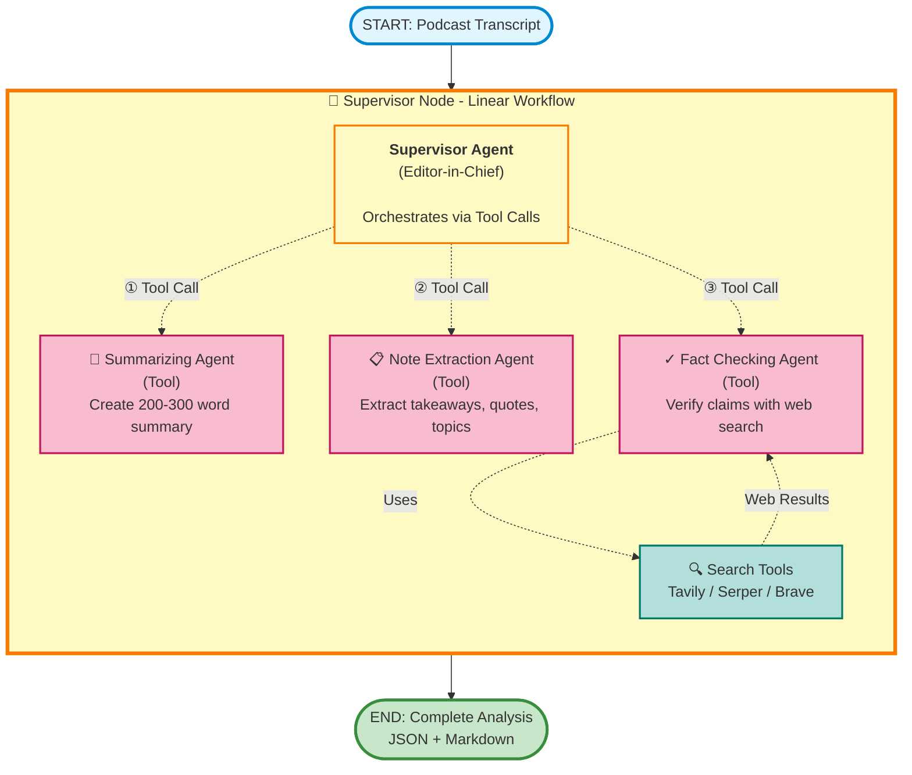

# Podcast Agent - AI-Powered Podcast Analysis

A sophisticated multi-agent system built with LangGraph that analyzes podcast transcripts using a supervisor-coordinated workflow with intelligent specialist agents, deep fact-checking, and comprehensive CloudWatch-compatible logging.

## Features

- **Supervisor-Coordinated Workflow**: Editor-in-Chief agent orchestrates specialist agents as tools
- **Intelligent Failover**: Llama Maverick primary models with automatic failover to OpenAI GPT-5 variants
- **Real-Time Specialist Agents**:
  - Summarizing Agent: Extracts core themes and comprehensive summaries
  - Note Extraction Agent: Pulls out takeaways, quotes, topics, and factual statements
  - Fact Checking Agent: Verifies claims using multiple search tools
- **Real-Time Progress**: Server-Sent Events (SSE) for live updates with detailed agent reasoning
- **CloudWatch-Ready Logging**: Structured JSON logs with session tracking for AWS CloudWatch
- **Auto-Validation Retry**: LLM self-correction mechanism for Pydantic validation failures
- **Output Files**: Automatically generates JSON and Markdown reports with fact-check tables
- **Single Container Deployment**: Easy Docker deployment to Render.com or any Docker platform
- **Professional UI**: Clean, responsive interface with real-time thought process visualization
- **Session Tracking**: Unique session IDs for each analysis with full traceability

## Architecture

### Agent Workflow (Linear LangGraph Flow)



**Key Architecture Points:**
- **Linear LangGraph Flow**: `START → Supervisor Node → END` (single node)
- **Internal Tool Orchestration**: Supervisor calls specialist agents as tools sequentially
- **Real-Time Progress**: SSE events emitted as each tool executes within the supervisor node

### How It Works

1. **User Input**: Podcast transcript is submitted via web UI or API
2. **Supervisor Agent** (Editor-in-Chief):
   - Analyzes the transcript
   - Orchestrates specialist agents as **tool calls**
   - Manages data flow between agents
   - Consolidates all results into final output

3. **Specialist Agents** (Called as Tools):
   - **Summarizing Agent**: Creates 200-300 word summary with core theme
   - **Note Extraction Agent**: Extracts takeaways, quotes, topics, and factual statements
   - **Fact Checking Agent**: Verifies claims using web search tools

4. **Search Integration**: Fact Checking Agent uses Tavily/Serper/Brave for verification

5. **Output**: Comprehensive JSON and Markdown reports with verified information

### Models Used (with Failover)

All agents use **Llama Maverick** as primary with automatic failover to **OpenAI GPT-5** variants:

- **Supervisor Agent**: Llama-4-Maverick-17B → OpenAI GPT-5 Nano (fallback)
- **Summarizing Agent**: Llama-4-Maverick-17B → OpenAI GPT-5 Nano (fallback)
- **Note Extraction Agent**: Llama-4-Maverick-17B → OpenAI GPT-5 Nano (fallback)
- **Fact Checking Agent**: Llama-4-Maverick-17B → OpenAI GPT-5 Mini (fallback)

**Failover Triggers**: API errors, rate limits, network errors, or any model failure automatically triggers fallback to OpenAI GPT-5 with full CloudWatch logging.

### Search Tools

- **[Tavily](https://tavily.com/)**: Advanced search with comprehensive filtering
  - [API Documentation](https://docs.tavily.com/)
  - [Python SDK](https://github.com/tavily-ai/tavily-python)
- **[Google Serper](https://serper.dev/)**: Current web search results
  - [LangChain Integration](https://python.langchain.com/docs/integrations/providers/google_serper/)
- **[Brave Search](https://brave.com/search/api/)**: Privacy-focused search engine

*(At least one search tool API key required)*

### Key Dependencies

This project is built with industry-standard tools and frameworks:

- **[LangGraph](https://github.com/langchain-ai/langgraph)** - Multi-agent orchestration framework
- **[LangChain](https://python.langchain.com/)** - LLM application framework
- **[FastAPI](https://fastapi.tiangolo.com/)** - Modern Python web framework
- **[Pydantic](https://docs.pydantic.dev/)** - Data validation using Python type annotations
- **[uv](https://github.com/astral-sh/uv)** - Fast Python package manager
- **[Tailwind CSS](https://tailwindcss.com/)** - Utility-first CSS framework for UI

## Quick Start (macOS)

### Prerequisites

1. **Homebrew** (if not installed):
   ```bash
   /bin/bash -c "$(curl -fsSL https://raw.githubusercontent.com/Homebrew/install/HEAD/install.sh)"
   ```

2. **Docker Desktop for Mac**:
   ```bash
   brew install --cask docker
   # Open Docker Desktop from Applications to complete setup
   ```

3. **Git** (usually pre-installed):
   ```bash
   brew install git  # If needed
   ```

### 5-Minute Setup

1. **Clone the repository**
   ```bash
   git clone https://github.com/MehdiZare/seekr-assignment.git
   cd assignment
   ```

2. **Configure API keys**
   ```bash
   cp .env.example .env
   # Edit .env with your actual API keys (see API Keys section below)
   nano .env  # or use your preferred editor
   ```

3. **Start with Docker**
   ```bash
   docker-compose up --build
   ```

4. **Access the application**
   ```
   http://localhost:8000
   ```

5. **Verify it's working**
   ```bash
   curl http://localhost:8000/api/health
   ```

## API Keys Setup

### Required API Keys

#### 1. Anthropic API Key
**Used for**: Claude models (optional - currently using OpenAI for failover)

**Get your key**:
1. Visit https://console.anthropic.com/
2. Sign up or log in
3. Go to "API Keys" section
4. Create a new key
5. Copy the key (starts with `sk-ant-`)

```bash
ANTHROPIC_API_KEY=sk-ant-api03-...
```

#### 2. Llama API Key
**Used for**: Llama-4-Maverick-17B (primary model for all agents)

**Get your key**:
1. Visit https://www.llama-api.com/ or your Llama API provider
2. Sign up for an account
3. Generate an API key
4. Copy the key

```bash
LLAMA_API_KEY=LL-...
```

#### 3. OpenAI API Key
**Used for**: OpenAI GPT-5 variants (failover model for all agents)

**Get your key**:
1. Visit https://platform.openai.com/
2. Sign up or log in
3. Go to "API Keys" section
4. Create a new key
5. Copy the key (starts with `sk-`)

```bash
OPENAI_API_KEY=sk-...
```

#### 4. Search Tool API Key (Choose at least ONE)

**Option A: Tavily (Recommended)**
- Visit https://tavily.com/
- Sign up and get your API key
- Free tier: 1,000 requests/month

```bash
TAVILY_API_KEY=tvly-...
```

**Option B: Serper**
- Visit https://serper.dev/
- Sign up and get your API key
- Free tier: 2,500 requests/month

```bash
SERPER_API_KEY=...
```

**Option C: Brave Search**
- Visit https://brave.com/search/api/
- Request API access
- Get your API key

```bash
BRAVE_API_KEY=...
```

### Optional API Keys

#### LangSmith (for Observability & Debugging)

**Get your key**:
1. Visit https://smith.langchain.com/
2. Sign up or log in
3. Go to Settings → API Keys
4. Create a new key

```bash
LANGSMITH_TRACING=true
LANGSMITH_ENDPOINT=https://api.smith.langchain.com
LANGSMITH_API_KEY=lsv2_pt_...
LANGSMITH_PROJECT=your-project-name
```

### Complete .env File Example

```bash
# LLM API Keys (Required)
ANTHROPIC_API_KEY=sk-ant-api03-your-key-here  # Optional - for Claude models
LLAMA_API_KEY=LL-your-key-here                # Required - primary model
OPENAI_API_KEY=sk-your-key-here               # Required - failover model

# Search Tool API Keys (At least one required)
TAVILY_API_KEY=tvly-your-key-here
SERPER_API_KEY=your-serper-key-here  # Optional
BRAVE_API_KEY=your-brave-key-here    # Optional

# LangSmith Tracing (Optional - for observability)
LANGSMITH_TRACING=true
LANGSMITH_ENDPOINT=https://api.smith.langchain.com
LANGSMITH_API_KEY=lsv2_pt_your-key-here
LANGSMITH_PROJECT=podcast-analysis
```

## Installation

### Option A: Docker (Recommended)

#### Install Docker Desktop (if not already installed)
```bash
brew install --cask docker
```

Open Docker Desktop from Applications and wait for it to start (Docker icon appears in menu bar).

#### Build and Run
```bash
# Clone repository
git clone https://github.com/MehdiZare/seekr-assignment.git
cd assignment

# Configure environment variables
cp .env.example .env
nano .env  # Add your API keys

# Build and start the application
docker-compose up --build

# The application will be available at http://localhost:8000
```

#### Docker Commands

```bash
# Start in detached mode (background)
docker-compose up -d

# View logs
docker-compose logs -f

# Stop the application
docker-compose down

# Rebuild after code changes
docker-compose up --build

# Clean rebuild (clears cache)
docker-compose build --no-cache
docker-compose up
```

### Option B: Local Development

#### 1. Install pyenv (Python Version Manager)

[pyenv](https://github.com/pyenv/pyenv) allows you to easily install and switch between multiple Python versions.

```bash
# Install pyenv via Homebrew
brew install pyenv

# Add pyenv to your shell (for zsh - default on macOS)
echo 'export PYENV_ROOT="$HOME/.pyenv"' >> ~/.zshrc
echo 'export PATH="$PYENV_ROOT/bin:$PATH"' >> ~/.zshrc
echo 'eval "$(pyenv init --path)"' >> ~/.zshrc
echo 'eval "$(pyenv init -)"' >> ~/.zshrc

# For bash, use ~/.bash_profile or ~/.bashrc instead
# Restart your terminal or run:
source ~/.zshrc  # or source ~/.bash_profile
```

#### 2. Install Python 3.12+

```bash
# Install Python 3.12 (or latest 3.12.x)
pyenv install 3.12.0

# Verify installation
pyenv versions
```

#### 3. Clone Repository and Set Python Version

```bash
# Clone repository
git clone https://github.com/MehdiZare/seekr-assignment.git
cd assignment

# Set local Python version for this project
pyenv local 3.12.0

# Verify Python version
python --version  # Should show Python 3.12.0
```

#### 4. Create Virtual Environment

```bash
# Create a virtual environment
python -m venv .venv

# Activate the virtual environment
source .venv/bin/activate  # On macOS/Linux

# Your prompt should now show (.venv) prefix
# To deactivate later, simply run: deactivate
```

#### 5. Install uv (Fast Python Package Manager)

```bash
# With virtual environment activated
curl -LsSf https://astral.sh/uv/install.sh | sh

# Restart your terminal or run:
source $HOME/.cargo/env

# Verify installation
uv --version
```

#### 6. Install Dependencies

```bash
# Ensure virtual environment is activated (.venv prefix in prompt)
# Configure environment variables first
cp .env.example .env
nano .env  # Add your API keys

# Install dependencies using uv
uv pip install -e .

# This installs all dependencies from pyproject.toml
```

#### 7. Run the Application

```bash
# With virtual environment activated
uvicorn app.main:app --host 0.0.0.0 --port 8000

# Application will be available at http://localhost:8000
```

#### 8. Development Workflow

```bash
# Always activate virtual environment before working
source .venv/bin/activate

# Run the application
uvicorn app.main:app --reload  # --reload for auto-restart on code changes

# When done, deactivate virtual environment
deactivate
```

## Usage

### Web Interface

1. Navigate to `http://localhost:8000`
2. Choose input method:
   - **Sample Transcripts**: Select from pre-loaded examples
   - **Upload File**: Upload .txt or .json file (minimum 100 characters)
   - **Paste Text**: Directly paste transcript text
3. Click "Analyze" and watch real-time progress with:
   - Supervisor decisions and agent coordination
   - Agent-by-agent progress (Summarizing → Note Extraction → Fact Checking)
   - Thought process visualization
   - Quality metrics dashboard
4. Review comprehensive results:
   - Summary with core themes and key discussions
   - Top 5 takeaways
   - Notable quotes with timestamps
   - Topics for tagging
   - Fact-checked claims with verification status
   - Quality metrics (overall reliability, research quality)
5. Download results as JSON or Markdown

### API Endpoints

#### Analyze Transcript (with SSE streaming)

```bash
curl -X POST http://localhost:8000/api/analyze \
  -H "Content-Type: application/json" \
  -d '{
    "transcript": "Your podcast transcript here...",
    "metadata": {
      "title": "Episode Title",
      "date": "2024-01-15"
    }
  }'
```

#### Upload File

```bash
curl -X POST http://localhost:8000/api/analyze/file \
  -F "file=@transcript.txt"
```

#### Health Check

```bash
curl http://localhost:8000/api/health

# Response:
# {
#   "status": "healthy",
#   "models_configured": 4,
#   "search_tools_available": 1
# }
```

#### List Sample Transcripts

```bash
curl http://localhost:8000/api/samples
```

#### Get Specific Sample

```bash
curl http://localhost:8000/api/samples/{sample_id}
```

## Configuration

### Application Settings (config.yaml)

```yaml
models:
  # Supervisor model - Primary: Llama Maverick, Fallback: OpenAI GPT-5 Nano
  model_c:
    provider: "llama"
    name: "Llama-4-Maverick-17B-128E-Instruct-FP8"
    temperature: 0.2
    max_tokens: 4000
    fallback:
      provider: "openai"
      name: "gpt-5-nano-2025-08-07"
      temperature: 0.2
      max_tokens: 4000

  # Fact-checking model - Primary: Llama Maverick, Fallback: OpenAI GPT-5 Mini
  model_d:
    provider: "llama"
    name: "Llama-4-Maverick-17B-128E-Instruct-FP8"
    temperature: 0.1
    max_tokens: 8000
    fallback:
      provider: "openai"
      name: "gpt-5-mini-2025-08-07"
      temperature: 0.1
      max_tokens: 8000

search_tools:
  tavily:
    search_depth: "advanced"
    max_results: 10
  serper:
    num_results: 10
  brave:
    count: 10

app:
  debug: false
  max_retries: 3           # LLM validation retry attempts
  stream_delay_ms: 100     # SSE event delay
```

### Customizing Models

You can adjust model parameters in `config.yaml`:

- **temperature**: Lower (0.1-0.3) for more focused outputs, higher (0.7-1.0) for more creative
- **max_tokens**: Increase for longer outputs (affects cost)
- **fallback**: Configure different fallback models or disable by removing fallback section

## CloudWatch Logging

All logs are output in JSON format, ready for AWS CloudWatch ingestion:

```json
{
  "timestamp": "2025-11-06T10:30:45.123456Z",
  "level": "INFO",
  "logger": "app.agents.supervisor",
  "message": "Tool execution completed successfully",
  "session_id": "a1b2c3d4-e5f6-7890-abcd-ef1234567890",
  "agent": "Summarizing Agent",
  "tool": "summarize_podcast_tool",
  "stage": "tool_execution_complete",
  "duration_ms": 2345,
  "environment": "production"
}
```

### CloudWatch Query Examples

```sql
# Find all sessions that triggered failover
fields @timestamp, session_id, agent, failover_triggered, failover_reason
| filter failover_triggered = true
| sort @timestamp desc

# Track a specific session
fields @timestamp, stage, agent, message
| filter session_id = "your-session-id"
| sort @timestamp asc

# Monitor performance
fields @timestamp, agent, duration_ms
| stats avg(duration_ms) by agent
```

## Project Structure

```
seekr-assignment/
├── app/                          # Main application package
│   ├── __init__.py
│   ├── main.py                   # FastAPI application with SSE streaming
│   ├── config.py                 # Configuration management
│   ├── constants.py              # Application constants
│   ├── agents/                   # Agent implementations
│   │   ├── __init__.py
│   │   ├── graph.py              # LangGraph workflow definition
│   │   ├── nodes.py              # LLM creation & failover logic
│   │   ├── supervisor.py         # Supervisor agent (coordinator)
│   │   ├── specialist_agents.py  # Summarizing, Notes, Fact-checking
│   │   ├── supervisor_tools.py   # Tool wrappers for supervisor
│   │   └── tools.py              # Search tools (Tavily, Serper, Brave)
│   ├── models/                   # Data models
│   │   ├── __init__.py
│   │   ├── outputs.py            # Output schemas (Pydantic)
│   │   ├── state.py              # LangGraph state
│   │   └── transcript.py         # Input models
│   ├── utils/                    # Utility modules
│   │   ├── __init__.py
│   │   └── logger.py             # JSON logging & session tracking
│   ├── static/                   # Static files
│   │   └── index.html            # UI (Tailwind CSS)
│   └── data/                     # Sample transcripts
│       ├── ep001_remote_work.json
│       ├── ep002_ai_healthcare.json
│       └── ep003_bootstrapping.json
├── .benchmarks/                  # Benchmark results (gitignored)
├── .venv/                        # Python virtual environment (gitignored)
├── output/                       # Generated analysis files (auto-created, gitignored)
├── test_realtime_streaming.py    # Test: Real-time streaming functionality
├── test_ui_fix.py               # Test: UI fixes
├── test_workflow.py             # Test: Workflow functionality
├── config.yaml                   # Application configuration
├── pyproject.toml               # Python dependencies & project metadata
├── requirements.txt             # Compiled dependencies (auto-generated by uv)
├── uv.lock                      # uv lock file for deterministic builds
├── runtime.txt                  # Python version for deployment
├── Dockerfile                    # Docker container definition
├── docker-compose.yml           # Local Docker Compose setup
├── render.yaml                  # Render.com deployment blueprint
├── .env.example                 # Environment variables template
├── .gitignore                   # Git ignore rules
├── DEPLOYMENT.md                # Detailed deployment documentation
└── README.md                    # This file
```

**Key Directories:**

- **`app/`** - Main application code
  - **`agents/`** - Multi-agent system implementation (supervisor + specialists)
  - **`models/`** - Pydantic models for data validation
  - **`utils/`** - Logging and utility functions
  - **`static/`** - Frontend UI
  - **`data/`** - Sample podcast transcripts
- **`.venv/`** - Python virtual environment (created during local setup)
- **`output/`** - Auto-generated analysis results (JSON & Markdown)
- **Test files** - Root-level test files for different components

## Troubleshooting

### Mac-Specific Issues

#### Docker Desktop Not Starting

```bash
# Check if Docker is running
docker info

# If not running, start Docker Desktop from Applications
open -a Docker

# Wait for Docker to start (Docker icon in menu bar)

# Verify installation
docker --version
docker-compose --version
```

#### Port 8000 Already in Use

```bash
# Find process using port 8000
lsof -i :8000

# Kill the process
kill -9 <PID>

# Or use a different port in docker-compose.yml:
# ports:
#   - "8080:8000"  # Access at localhost:8080
```

#### M1/M2/M3 Apple Silicon Compatibility

**Docker**: The Docker image is built for `linux/amd64` platform. Docker Desktop on Apple Silicon (M1/M2/M3) handles this automatically via Rosetta 2 translation, but if you encounter issues:

```yaml
# In docker-compose.yml, add:
services:
  app:
    platform: linux/amd64
```

**Local Development**: pyenv works natively on Apple Silicon. When installing Python, pyenv will automatically build the appropriate ARM64 version for your chip.

```bash
# Check your architecture
uname -m  # Should show "arm64" on Apple Silicon

# Check Python version and architecture
python --version  # Should show Python 3.12.x
python -c "import platform; print(platform.machine())"  # Should show "arm64"
```

#### Python Version Issues (Local Development)

```bash
# Check current Python version
python --version

# If using wrong version, set with pyenv
pyenv local 3.12.0

# Verify pyenv is working
pyenv which python

# If pyenv is not recognized, add to shell
echo 'eval "$(pyenv init -)"' >> ~/.zshrc
source ~/.zshrc

# Reinstall Python if needed
pyenv install --list | grep 3.12  # See available versions
pyenv install 3.12.0
```

### General Issues

#### API Key Errors

```bash
# Verify .env file exists
ls -la .env

# Check if keys are set
cat .env | grep API_KEY

# Ensure no extra spaces around = sign
# ✅ CORRECT: ANTHROPIC_API_KEY=sk-ant-...
# ❌ WRONG:   ANTHROPIC_API_KEY = sk-ant-...
```

#### Search Tool Errors

```bash
# Verify at least one search tool key is configured
cat .env | grep -E '(TAVILY|SERPER|BRAVE)_API_KEY'

# Test search tool directly
curl "https://api.tavily.com/search" \
  -H "Content-Type: application/json" \
  -d '{"api_key":"your-key","query":"test"}'
```

#### Docker Build Fails

```bash
# Clear Docker cache
docker-compose down
docker system prune -a  # Warning: removes all unused images
docker-compose build --no-cache
docker-compose up
```

#### Out of Memory

```bash
# Increase Docker Desktop memory allocation:
# Docker Desktop → Settings → Resources → Memory
# Recommended: 4GB minimum, 8GB for optimal performance
```

#### Import Errors (Local Development)

```bash
# Reinstall dependencies
uv pip install --force-reinstall -e .

# Or clear cache and reinstall
rm -rf ~/.cache/uv
uv pip install -e .
```

## Performance Metrics

### Expected Processing Times

- Supervisor Coordination: 2-3 seconds
- Summarizing Agent: 5-8 seconds
- Note Extraction Agent: 5-8 seconds
- Fact Checking Agent: 15-25 seconds (with search tools)
- **Total**: 30-45 seconds per transcript

### Token Usage (Estimated)

- Supervisor: ~2,000 tokens
- Summarizing Agent: ~3,000 tokens
- Note Extraction Agent: ~3,000 tokens
- Fact Checking Agent: ~6,000 tokens (with tool calls)
- **Total**: ~14,000 tokens per analysis

## Development

### Adding Sample Transcripts

Place JSON files in `app/data/`:

```json
{
  "transcript": "Full transcript text here...",
  "metadata": {
    "title": "Episode Title",
    "date": "2024-01-15",
    "speakers": ["Speaker 1", "Speaker 2"]
  }
}
```

### Running Tests

The project includes three test files in the root directory:

- **`test_workflow.py`** - Tests the core workflow and agent coordination
- **`test_realtime_streaming.py`** - Tests real-time SSE streaming functionality
- **`test_ui_fix.py`** - Tests UI-related fixes and behavior

```bash
# Activate virtual environment first
source .venv/bin/activate

# Install test dependencies
uv pip install pytest pytest-asyncio httpx

# Run all tests
pytest

# Run a specific test file
pytest test_workflow.py

# Run tests with verbose output
pytest -v

# Run tests with coverage
pytest --cov=app

# Generate HTML coverage report
pytest --cov=app --cov-report=html
# View report: open htmlcov/index.html
```

**Note**: Tests are currently in the project root. For better organization, consider moving them to a `tests/` directory in the future.

### Code Quality

```bash
# Install development tools
uv pip install ruff black mypy

# Format code
black app/

# Lint
ruff check app/

# Type check
mypy app/
```

## Deployment

### Render.com (Recommended)

Render.com provides easy Docker-based deployment with automatic HTTPS.

#### Quick Deploy

1. **Push to GitHub**
   ```bash
   git add .
   git commit -m "Prepare for deployment"
   git push
   ```

2. **Create Render Account**
   - Sign up at [render.com](https://render.com)
   - Connect your GitHub account

3. **Deploy via Blueprint**
   - Click "New +" → "Blueprint"
   - Select your repository
   - Render auto-detects `render.yaml`
   - Click "Apply"

4. **Configure Environment Variables**
   - Go to your service in Render Dashboard
   - Navigate to "Environment" tab
   - Add required API keys:
     ```
     LLAMA_API_KEY (required - primary model)
     OPENAI_API_KEY (required - failover model)
     TAVILY_API_KEY (or SERPER_API_KEY or BRAVE_API_KEY)
     ANTHROPIC_API_KEY (optional - for Claude models)
     ```
   - Optional: Add LangSmith keys for observability

5. **Access Your App**
   - First deploy: ~5-10 minutes
   - Your app: `https://your-app-name.onrender.com`
   - Health check: `https://your-app-name.onrender.com/api/health`

#### Free vs Paid Tiers

**Free Tier:**
- 750 hours/month
- Spins down after 15 min inactivity
- First request after spin-down: ~30 seconds

**Starter ($7/mo):**
```yaml
# In render.yaml
plan: starter  # No spin-down
```

### AWS App Runner / ECS

See [DEPLOYMENT.md](DEPLOYMENT.md) for detailed AWS deployment instructions.

## Acknowledgments

- Built with [LangGraph](https://github.com/langchain-ai/langgraph)
- Powered by [FastAPI](https://fastapi.tiangolo.com/)
- UI styled with [Tailwind CSS](https://tailwindcss.com/)
- Package management with [uv](https://github.com/astral-sh/uv)
- Logging with [python-json-logger](https://github.com/madzak/python-json-logger)

## Support

For issues, questions, or contributions, please open an issue on the [GitHub repository](https://github.com/MehdiZare/seekr-assignment/issues).

## License

MIT License

Copyright (c) 2025 Mehdi Zare

Permission is hereby granted, free of charge, to any person obtaining a copy of this software and associated documentation files (the "Software"), to deal in the Software without restriction, including without limitation the rights to use, copy, modify, merge, publish, distribute, sublicense, and/or sell copies of the Software, and to permit persons to whom the Software is furnished to do so, subject to the following conditions:

The above copyright notice and this permission notice shall be included in all copies or substantial portions of the Software.

THE SOFTWARE IS PROVIDED "AS IS", WITHOUT WARRANTY OF ANY KIND, EXPRESS OR IMPLIED, INCLUDING BUT NOT LIMITED TO THE WARRANTIES OF MERCHANTABILITY, FITNESS FOR A PARTICULAR PURPOSE AND NONINFRINGEMENT. IN NO EVENT SHALL THE AUTHORS OR COPYRIGHT HOLDERS BE LIABLE FOR ANY CLAIM, DAMAGES OR OTHER LIABILITY, WHETHER IN AN ACTION OF CONTRACT, TORT OR OTHERWISE, ARISING FROM, OUT OF OR IN CONNECTION WITH THE SOFTWARE OR THE USE OR OTHER DEALINGS IN THE SOFTWARE.
